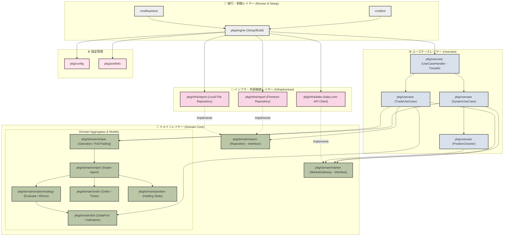
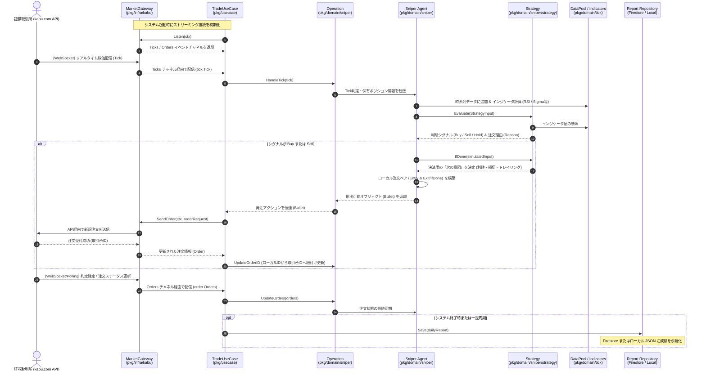
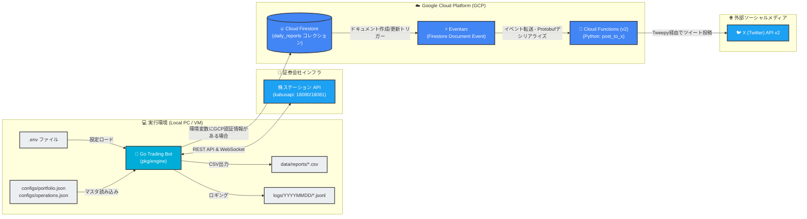

# Trading Bot

## 実行手順

1. 以下のコマンドで実行ファイルをビルドします。
   ```bash
   env GOOS=windows GOARCH=amd64 go build -o bot.exe ./cmd/bot
   ```

2. 実行ファイルと同じディレクトリに`.env`ファイルを配置します。

   `.env`ファイルには以下の環境変数を設定します。

   ```
   BROKER_TYPE=kabu
   KABU_API_URL=http://localhost:18081/kabusapi
   KABU_PASSWORD=<あなたのパスワード>
   ```

   - `BROKER_TYPE`: `kabu` を設定します（株ステーション用）。
   - `KABU_API_URL`: 検証用は `http://localhost:18081/kabusapi`、本番用は `http://localhost:18080/kabusapi` を設定します。
   - `KABU_PASSWORD`: 株ステーションのパスワードを設定します。

3. PowerShellから実行ファイルを実行します（実行ファイルと同じディレクトリにいることを確認してください）。
   ```powershell
   ./bot.exe
   ```

## ソフトウェアアーキテクチャ

本リポジトリは、モジュール間の結合度を低く保ち、テスト容易性および拡張性を高めるため、**クリーンアーキテクチャ（Clean Architecture）** を基盤に設計されています。

### 1. 静的構造（パッケージ依存関係）

依存関係は外側から内側（ドメインコア）に向かって一方向のみに流れる原則（Dependency Rule）を徹底しています。



---

### 2. 動的処理フロー（時価受信から判定・発注まで）

リアルタイムの時価情報（Tick）を受信し、テクニカル分析指標の更新から戦略判定、そして自動発注・成績記録までのデータ連携フローを示します。



---

### 3. クラウドインフラ連携（システム全体像）

Trading Botが本番環境（あるいはバックテスト）で動いた際、どのようにクラウドサービス（Google Cloud Platform: GCP）や外部APIと連携するのかを示した構成図です。


