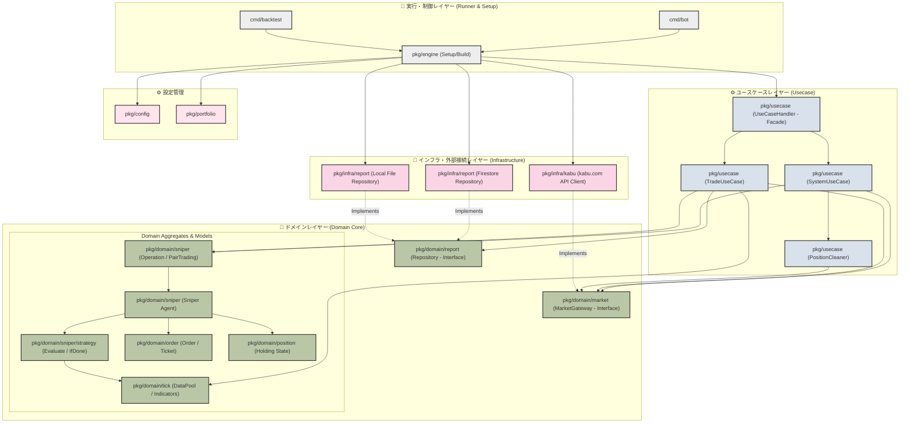
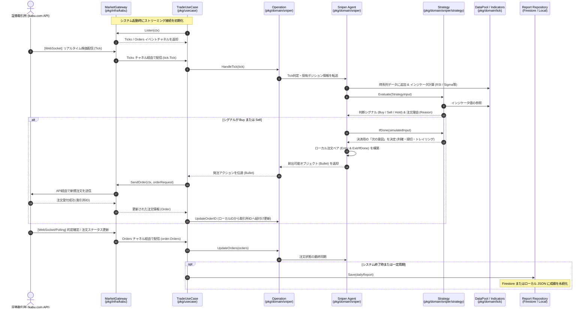
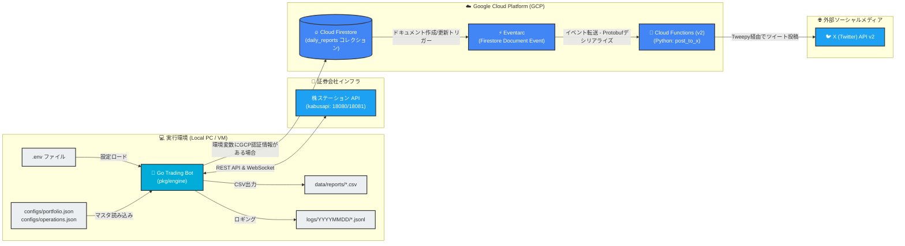

# 📐 システム詳細設計・アーキテクチャ (Architecture & Design)

本ドキュメントでは、Trading Botフレームワークのモジュール構造、時価判定から発注までの処理フロー、クラウド連携インフラ、および資本保護を実現する設計パターンについて解説します。

---

## 1. 静的構造（パッケージ依存関係）

本システムは、モジュール間の結合度を極限まで低く保ち、検証性（テスト容易性）と拡張性を高めるため、**クリーンアーキテクチャ (Clean Architecture)** を設計基盤に採用しています。

依存関係は外側から内側（ドメインコア）に向かって一方向のみに流れる原則（Dependency Rule）を徹底しており、インフラ（外部API）を変更してもコアビジネスロジックは影響を受けない設計になっています。

### 依存関係逆転の原則 (DIP) によるモック化
インフラと接続するゲートウェイ部分を `MarketGateway` インターフェースで抽象化しているため、実機の株ステーション接続用クライアント（[pkg/infra/kabu](file:///home/umemoto/trading-workspace/trading-bot/pkg/infra/kabu/market_gateway.go)）と、バックテスト用のインメモリ再生シミュレータ（[pkg/infra/backtest](file:///home/umemoto/trading-workspace/trading-bot/pkg/infra/backtest/gateway.go)）を、ユースケース層を一切変更することなく差し替えて実行することができます。

---

## 2. 動的処理フロー（時価受信から判定・発注まで）

WebSocketによるリアルタイム株価データ受信（Tickイベント）を起点として、テクニカル分析指標の計算、戦略評価、発注処理、取引成績の記録にいたる一連のライフサイクル・データフローです。

---

## 3. 安全性を支える設計パターン (Decorator Pattern)

実資金を市場で運用するにあたり、最も重視すべきは**「想定外のバグや通信断による不要・無謀な注文の徹底防止（資本保護）」**です。

本システムでは、すべての取引戦略に対し**デコレータ（Decorator）パターン**を適用して安全ラッパーを実装しており、個別の取引ロジック自体に複雑な保護コードを書くことなく、透過的に安全ガードを何重にも構築できる仕組みをとっています。

### 🛡️ ウォームアップストッパー ([WarmupStrategy](file:///home/umemoto/trading-workspace/trading-strategy-private/internal/strategies/warmup.go#L12))
* **目的**: 起動直後の数十分間など、テクニカル分析指標（移動平均など）を正しく計算するためのデータ履歴（時系列Tick）が十分に蓄積されていない期間中の誤判定を防ぎます。
* **動作**: 起動から指定時間内（例: 5分）かつノーポジションである場合、ベース戦略がどのような注文判断を行おうとも強制的に `HOLD` を返して新規エントリーをブロックします。

### 💵 予算制御プロキシ ([BudgetConstraint](file:///home/umemoto/trading-workspace/trading-strategy-private/internal/strategies/budget.go#L12))
* **目的**: システムバグによる無限ナンピン発注や、注文バッチ重複による資金キャパシティ超過を完全に防止します。
* **動作**: 現在の評価額およびベース戦略が提示した発注数量に伴う「概算必要投資額」を計算し、あらかじめ設定した最大投資予算を超える発注をすべて強制的に `HOLD`（ポジション維持）にクランプします。

### 🕒 時間窓・大引け制御 ([TradingTimeWindowWrapper](file:///home/umemoto/trading-workspace/trading-strategy-private/internal/strategies/trading_time_window_wrapper.go#L10))
* **目的**: 取引対象外の時間帯の誤注文を完全に制限し、大引け前（例: 15:25）に強制手仕舞いを行ってオーバーナイト（持越し）リスクを排除します。
* **動作**:
  * 取引可能時間（例: 前場9:00-11:30、後場12:30-15:00）以外の時間帯は強制的にブラックアウトして新規買い・売りを遮断します。
  * 設定した大引け前決済時刻（例: 15:25）以降にポジションを保有している場合、強制的にすべてのポジションを市場注文でクローズさせます。

---

## 4. クラウドインフラ連携（システム全体像）

Trading Botが本番環境で動いた際、どのようにクラウドサービス（Google Cloud Platform: GCP）や外部APIと連携するのかを示した構成図です。

GCP（Firestore/Eventarc）および X（Twitter）APIとの連携は**完全に任意**です。環境変数 `GOOGLE_APPLICATION_CREDENTIALS` が設定されていない場合、Botは自動的に**ローカル保存モード（`./data/reports/` 配下へのJSON/CSV出力）**へフォールバックして稼働します。
